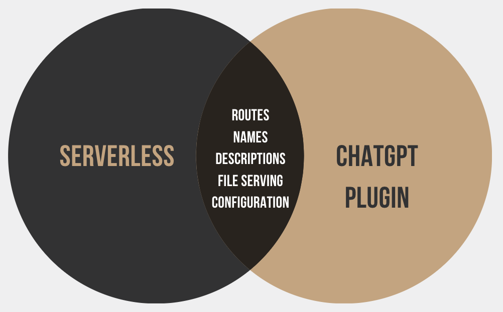

# Serverless ChatGPT Plugin
The Serverless ChatGPT Plugin makes it easy to create ChatGPT-based applications with minimal configuration. The plugin takes care of setting up the necessary configuration files and resources required by OpenAI, allowing you to focus on building engaging conversational experiences.



### Local File Serving
Our Serverless plugin now supports serving local files required by ChatGPT, facilitating quick integration with OpenAI on localhost.

## Usage
Use the <a href="https://github.com/ThalesDavila/serverless-chatgpt-template" target="_blank">serverless-chatgpt-template</a> GitHub template.
Then, you can just start coding! 

### How it works
The serverless-chatgpt plugin automates the creation of OpenAI ChatGPT plugins, generating necessary files and creating a compliant Lambda function. It can be configured to work locally with serverless-offline, allowing for easy testing and debugging.
[](https://mermaid.live/edit#pako:eNqVlF1LwzAUhv_KId5uovO7grBvJw4GHQimu4jNaRdMk5Km0yH776Ypugm7MHcnOc_7npMmp18k1RxJRHLDyjUsB4kC6NMKzQaNxKo63RZyBd3uAwwOdrvpmtm8tLCQdS7UqlENPDWkU1RomMUK5kyJDCsLTHHoL2YwwkwoYYVWMBHO50A3okODXtV_ieGZFW-cwaRWaUMfcGM61CoTeW0cetCQzjIpFEKmDTzrlElYuspC5V478toJbbybRqau0gfb-tzY56a0VcXe0ieGPvFIY6sNchAK5lho06omPjmjM7XR766VYx1PPfNEY1HUsj3bvrb_KMdUj63zPnxqQne499huJcIZVNa4mtFJD1N-c95pl90Pwe066pWf93_580C-F8hfBPKXgfxVIH8dyN8E8reB_F3off3ngkmHFGgKJrib3a_GICF2jQUmJHKhCwyTPCGJ2jmU1VbHW5WSyJoaO6QuuXuEI8Hc1BckypisfnfHXLj3_ruJfjlvfxKpHz1nWDL1qvWPdPcNQbZxVw)

Then, add the **serverless-offline** plugin to the **serverless.yaml** file. This is required in order to serve locally your handler functions.
```
plugins:
  - serverless-offline
  - serverless-chatgpt
```

Run your Serverless application in offline mode (```sls offline```). The plugin will automatically serve these files at their respective endpoints.

The endpoint will be /.well-known/{name}. This endpoint will serve the files required for the chatgpt integration:
- /.well-known/ai-plugin.json
- /.well-known/openapi.yaml
- /.well-known/logo.png

> :information_source: This feature is particularly useful for testing your OpenAI integration locally before deploying to a live environment.

## Features
- Automatically generates and configures the necessary resources for ChatGPT integration.
- Easy-to-use with minimal configuration needed.
- Streamlines the deployment process of your ChatGPT-based applications.

## Limitations
- Provider: the plugin only supports AWS as the cloud provider.
- No auth configuration for chatgpt.
If you need additional customization or support for other cloud providers, please open an issue, and we'll consider adding it based on the community's interest.

## Contributing
Contributions to the Serverless ChatGPT Plugin are welcome! To contribute, please follow these steps:

- Fork the repository.
- Create a new branch with a descriptive name.
- Make your changes and commit them with a meaningful commit message.
- Submit a pull request, and provide a detailed description of your changes.
- Please make sure your changes follow our coding guidelines and include tests if applicable.

## License
This project is licensed under the MIT license.

## Support
If you encounter any issues or have questions about the Serverless ChatGPT Plugin, please open an issue on our GitHub repository or contact the maintainers.
